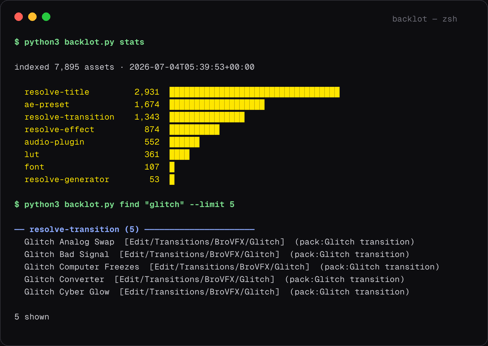

# backlot

**You own more than you think. Index it.**

[](LICENSE)
[](backlot.py)
[](backlot.py)



Every editor's machine is a warehouse: After Effects presets, Resolve title
packs, LUT folders, audio plugins, fonts — thousands of assets bought,
bundled, and forgotten. backlot walks the warehouse and hands you the
manifest. The machine above turned out to be holding **7,895 assets**. The
`.drfx` deep-scan alone surfaced ~5,200 Resolve templates that never appear
in any file browser, because they live inside zip archives.

One Python file. Standard library only. Nothing to install.

```bash
curl -O https://raw.githubusercontent.com/vcspr/backlot/main/backlot.py
python3 backlot.py scan
python3 backlot.py find "glitch"
python3 backlot.py stats
```

## What it scans

| type | where it looks |
|---|---|
| `ae-preset` | After Effects `.ffx` — app Presets and User Presets, every installed version |
| `resolve-*` | Resolve Fusion Templates, user and system — **including inside `.drfx` archives** (titles, transitions, generators, effects) |
| `lut` | Resolve LUT dirs — `.cube` `.3dl` `.dat` |
| `audio-plugin` | `/Library/Audio/Plug-Ins` — VST, VST3, AU, AAX |
| `font` | User and system font folders |

Anything else — Motion Bro packs, sample libraries, a stock folder — goes in
`backlot.config.json`:

```json
{ "extra_dirs": { "sample": ["~/Music/Samples"], "mogrt": ["~/Motion Templates"] } }
```

## Built for agents too

Every command takes `--json`. The index itself is flat JSON with stable keys
(`type`, `name`, `category`, `path`, `source`), so an AI agent, an MCP server,
or a 5-line script can answer "what glitch transitions do I own?" without
opening a single app. Paths are stored home-relative, so the index is safe to
share and diff.

```bash
python3 backlot.py find "film grain" --type lut --json
```

## Why

Asset hoarding is universal; asset *recall* is rare. The difference between
owning 3,000 titles and using them is a search box. This started as the index
layer of a larger creative-automation system, where an AI agent picks the
title template; it stands alone because the manifest is useful even without
the agent.

## Roadmap

- Windows paths
- Premiere / Final Cut template scanners
- `backlot serve` — MCP server mode, so agents query the index natively
- Duplicate finder (same LUT in four packs)

## License

[MIT](LICENSE) © 2026 Victor Uwakwe
